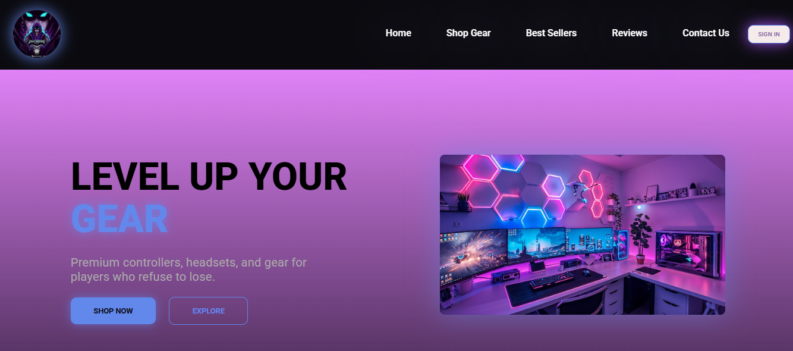

# Gaming Gear Store 🎮

A responsive e-commerce landing page for premium gaming gear. Built with a neon, gaming-focused UI to showcase products like controllers, headsets, monitors, and chairs.

## ✨ Features
- **Category Filtering**: Filter products by Controllers, Headsets, Monitors, Chairs, Accessories
- **Product Pagination**: Clean 2-page layout for Shop and Best Sellers sections
- **Neon UI/UX**: Gradient backgrounds, glow effects, and hover animations
- **Fully Responsive**: Looks great on desktop and mobile
- **Best Sellers Section**: Highlights top products with badges

## 🛠️ Tech Stack
- **HTML5** - Semantic structure
- **CSS3** - Custom styling, Flexbox, Grid, Animations  
- **Vanilla JavaScript** - Filtering and pagination logic

## 🚀 Live Demo
Coming Soon: `https://your-username.github.io/gaming-gear-store/`

## 📸 Screenshot


## 📦 How to Run Locally
1. Clone the repo
```bash
git clone https://github.com/YOUR-USERNAME/gaming-gear-store.git
